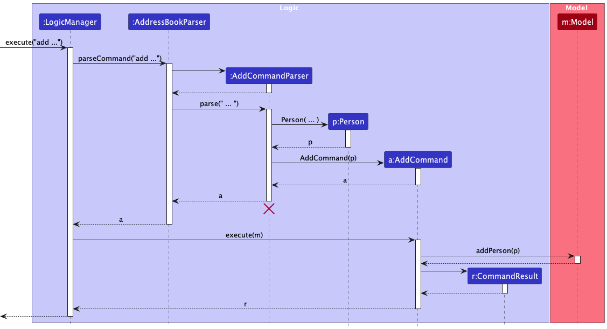
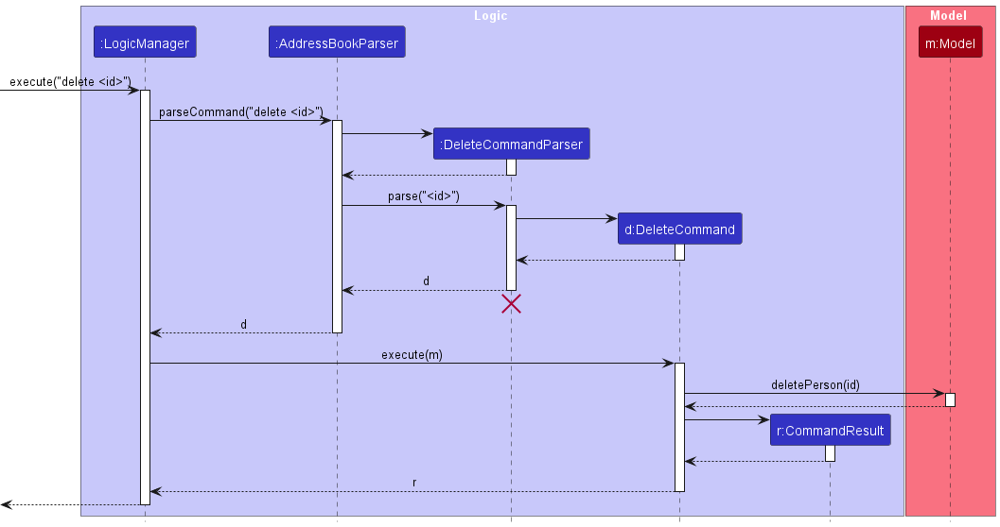
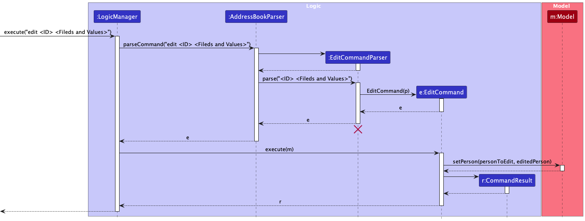
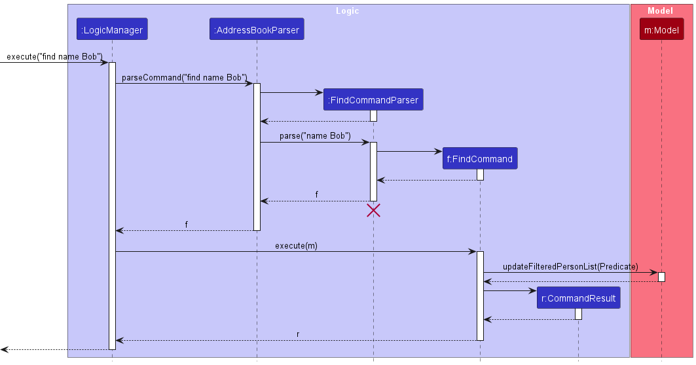
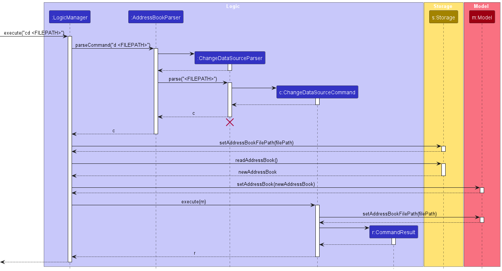
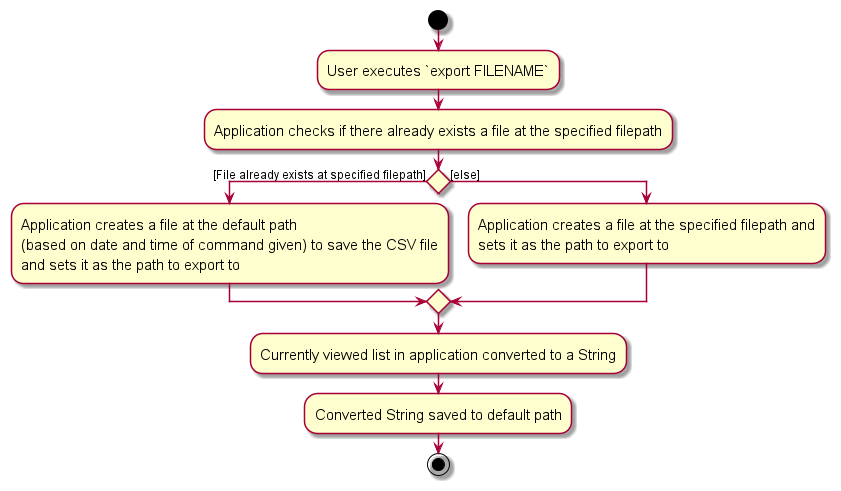
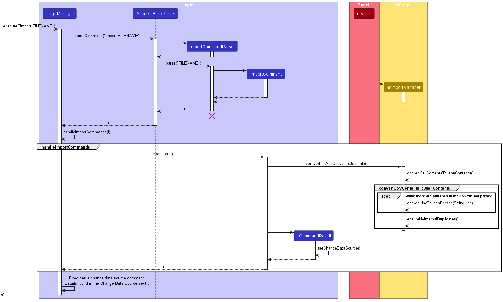
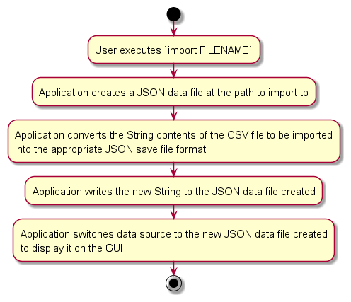
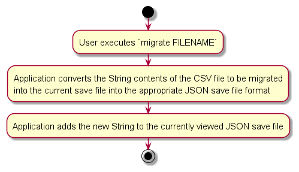

* Table of Contents
{:toc}

--------------------------------------------------------------------------------------------------------------------

## **Acknowledgements**

* This project is based on the AddressBook-Level3 project created by the [SE-EDU initiative](https://se-education.org).
--------------------------------------------------------------------------------------------------------------------

## **Setting up, getting started**

Refer to the guide [_Setting up and getting started_](SettingUp.md).

--------------------------------------------------------------------------------------------------------------------

## **Design**

:bulb: **Tip:** The `.puml` files used to create diagrams in this document `docs/diagrams` folder. Refer to the [_PlantUML Tutorial_ at se-edu/guides](https://se-education.org/guides/tutorials/plantUml.html) to learn how to create and edit diagrams.

### Architecture

The ***Architecture Diagram*** given above explains the high-level design of the App.

Given below is a quick overview of main components and how they interact with each other.

**Main components of the architecture**

**`Main`** (consisting of classes [`Main`](https://github.com/se-edu/addressbook-level3/tree/master/src/main/java/seedu/address/Main.java) and [`MainApp`](https://github.com/se-edu/addressbook-level3/tree/master/src/main/java/seedu/address/MainApp.java)) is in charge of the app launch and shut down.
* At app launch, it initializes the other components in the correct sequence, and connects them up with each other.
* At shut down, it shuts down the other components and invokes cleanup methods where necessary.

The bulk of the app's work is done by the following four components:

* [**`UI`**](#ui-component): The UI of the App.
* [**`Logic`**](#logic-component): The command executor.
* [**`Model`**](#model-component): Holds the data of the App in memory.
* [**`Storage`**](#storage-component): Reads data from, and writes data to, the hard disk.

[**`Commons`**](#common-classes) represents a collection of classes used by multiple other components.

**How the architecture components interact with each other**

The *Sequence Diagram* below shows how the components interact with each other for the scenario where the user issues the command `delete 00001`.

Each of the four main components (also shown in the diagram above),

* defines its *API* in an `interface` with the same name as the Component.
* implements its functionality using a concrete `{Component Name}Manager` class (which follows the corresponding API `interface` mentioned in the previous point.

For example, the `Logic` component defines its API in the `Logic.java` interface and implements its functionality using the `LogicManager.java` class which follows the `Logic` interface. Other components interact with a given component through its interface rather than the concrete class (reason: to prevent outside component's being coupled to the implementation of a component), as illustrated in the (partial) class diagram below.

The sections below give more details of each component.

### UI component

The **API** of this component is specified in [`Ui.java`](https://github.com/se-edu/addressbook-level3/tree/master/src/main/java/seedu/address/ui/Ui.java)

The UI consists of a `MainWindow` that is made up of parts e.g.`CommandBox`, `ResultDisplay`, `PersonListPanel`, `StatusBarFooter` etc. All these, including the `MainWindow`, inherit from the abstract `UiPart` class which captures the commonalities between classes that represent parts of the visible GUI.

The `UI` component uses the JavaFx UI framework. The layout of these UI parts are defined in matching `.fxml` files that are in the `src/main/resources/view` folder. For example, the layout of the [`MainWindow`](https://github.com/se-edu/addressbook-level3/tree/master/src/main/java/seedu/address/ui/MainWindow.java) is specified in [`MainWindow.fxml`](https://github.com/se-edu/addressbook-level3/tree/master/src/main/resources/view/MainWindow.fxml)

The `UI` component,

* executes user commands using the `Logic` component.
* listens for changes to `Model` data so that the UI can be updated with the modified data.
* keeps a reference to the `Logic` component, because the `UI` relies on the `Logic` to execute commands.
* depends on some classes in the `Model` component, as it displays `Person` object residing in the `Model`.

### Logic component

**API** : [`Logic.java`](https://github.com/se-edu/addressbook-level3/tree/master/src/main/java/seedu/address/logic/Logic.java)

Here's a (partial) class diagram of the `Logic` component:

The sequence diagram below illustrates the interactions within the `Logic` component, taking `execute("delete <id>")` API call as an example.

The sequence diagram below shows another example of interactions within the `Logic` component, taking `execute("find name Bob")` API call as an example.

:information_source: **Note:** The lifeline for `DeleteCommandParser` should end at the destroy marker (X) but due to a limitation of PlantUML, the lifeline continues till the end of diagram.

How the `Logic` component works:

1. When `Logic` is called upon to execute a command, it is passed to an `AddressBookParser` object which in turn creates a parser that matches the command (e.g., `DeleteCommandParser`) and uses it to parse the command.
1. This results in a `Command` object (more precisely, an object of one of its subclasses e.g., `DeleteCommand`) which is executed by the `LogicManager`.
1. The command can communicate with the `Model` when it is executed (e.g. to delete a person). 
   Note that although this is shown as a single step in the diagram above (for simplicity), in the code it can take several interactions (between the command object and the `Model`) to achieve.
1. The result of the command execution is encapsulated as a `CommandResult` object which is returned back from `Logic`.

Here are the other classes in `Logic` (omitted from the class diagram above) that are used for parsing a user command:

How the parsing works:
* When called upon to parse a user command, the `AddressBookParser` class creates an `XYZCommandParser` (`XYZ` is a placeholder for the specific command name e.g., `AddCommandParser`) which uses the other classes shown above to parse the user command and create a `XYZCommand` object (e.g., `AddCommand`) which the `AddressBookParser` returns back as a `Command` object.
* All `XYZCommandParser` classes (e.g., `AddCommandParser`, `DeleteCommandParser`, ...) inherit from the `Parser` interface so that they can be treated similarly where possible e.g, during testing.

### Model component
**API** : [`Model.java`](https://github.com/se-edu/addressbook-level3/tree/master/src/main/java/seedu/address/model/Model.java)

The `Model` component,

* stores the address book data i.e., all `Person` objects (which are contained in a `UniquePersonList` object).
* stores the currently 'selected' `Person` objects (e.g., results of a search query) as a separate _filtered_ list which is exposed to outsiders as an unmodifiable `ObservableList<Person>` that can be 'observed' e.g. the UI can be bound to this list so that the UI automatically updates when the data in the list change.
* stores a `UserPref` object that represents the user’s preferences. This is exposed to the outside as a `ReadOnlyUserPref` objects.
* does not depend on any of the other three components (as the `Model` represents data entities of the domain, they should make sense on their own without depending on other components)

:information_source: **Note:** An alternative (arguably, a more OOP) model is given below. It has a `Tag` list in the `AddressBook`, which `Person` references. This allows `AddressBook` to only require one `Tag` object per unique tag, instead of each `Person` needing their own `Tag` objects. 

### Storage component

**API** : [`Storage.java`](https://github.com/se-edu/addressbook-level3/tree/master/src/main/java/seedu/address/storage/Storage.java)

The `Storage` component,
* can save both address book data and user preference data in JSON format, and read them back into corresponding objects.
* inherits from both `AddressBookStorage` and `UserPrefStorage`, which means it can be treated as either one (if only the functionality of only one is needed).
* depends on some classes in the `Model` component (because the `Storage` component's job is to save/retrieve objects that belong to the `Model`)

### Common classes

Classes used by multiple components are in the `seedu.addressbook.commons` package.

--------------------------------------------------------------------------------------------------------------------

## **Implementation**

This section describes some noteworthy details on how certain features are implemented.

### Add feature

#### Implementation

The `add` mechanism is facilitated by `ModelManager`. It extends `Model`, stored internally as a `FilteredList`. Additionally, it implements the following operation:

* `ModelManager#addPerson(Person person)` — Adds the person inside the `FilteredList`.

The following sequence diagram shows how `add <name><Phone_number1>...` command works:

:information_source: **Note:** An error will occur if no parameters are provided for the `add` command, as the command requires at least one parameter to add a new student contact to the list.

#### Design considerations

**Aspect: Input parameter representation in the add function:**

* **Alternative 1 (current choice):** Utilize descriptive tags such as "n/NAME", "p/PARENT_PHONE_NUMBER_1, [PARENT_PHONE_NUMBER_2]", "e/STUDENT_EMAIL", "a/ADDRESS", "id/STUDENT_ID", "class/CLASS_NAME" and optionally "t/TAG".
    * Pros: Offers clarity and ensures users understand the purpose of each input parameter.
    * Cons: Users may need to input more characters, potentially increasing effort and time required.

* **Alternative 2:** Utilize concise and intuitive input parameters, such as "name", "phone", "email", "address", "id", "class", and optionally "tag".
    * Pros: Streamlines the input process by using familiar terms, reducing user cognitive load and minimizing input errors.
    * Cons: May sacrifice some specificity compared to Alternative 1, potentially leading to ambiguity in certain cases.

--------------------------------------------------------------------------------------------------------------------

### Delete feature

#### Implementation

The `delete` mechanism is facilitated by `ModelManager`. It extends `Model`, stored internally as a `FilteredList`. Additionally, it implements the following operation:

* `ModelManager#deletePerson(Person target)` — Deletes the target Person inside the `FilteredList`.

The following sequence diagram shows how `delete <id>` command works:

:information_source: **Note:** `delete` command will not delete any student from the contact list if the `id` does not match with any student.

#### Design considerations

**Aspect: How to find which student to delete:**
* **Alternative 1 (current choice):** Delete student depending on unique `Student Id`.
  * Pros: Can make sure we delete the correct student.
  * Cons: Users may need extra steps to find the `Student Id` if they don't remember it.

* **Alternative 2:** Delete student depending on `Name`.
  * Pros: The user can delete the student efficiently.
  * Cons: There is a possibility that two students have the same name and the `delete` function may not delete the intended student.

--------------------------------------------------------------------------------------------------------------------
### Edit feature

#### Implementation

The `edit` mechanism is facilitated by `ModelManager`. It extends `Model`, stored internally as a `FilteredList`. Additionally, it implements the following operation:

* `ModelManager#SetPerson(Person target, Person editedPerson)` — Replaces target with editedPerson in `FilteredList`.

The following sequence diagram shows how `edit id <name><Phone_number1>...` command works:

:information_source: **Note:** An error will be generated if no parameters are provided for the `edit` command, as at least one parameter must be specified to execute the edit operation.

#### Design considerations

**Aspect: Editing an existing student contact in the student contact list:**

* **Alternative 1 (current choice):** Use the student's unique `STUDENT_ID` to identify and edit the corresponding student contact.
    * Pros: Ensures accurate editing of the intended student contact without ambiguity.
    * Cons: Users may need to remember or retrieve the specific `STUDENT_ID` before initiating the edit operation.

* **Alternative 2:** Allow editing based on alternative identifiers such as `NAME`, `EMAIL`, or `PARENT_PHONE_NUMBER`.
    * Pros: Provides flexibility for users to edit student contacts using more readily available information.
    * Cons: May introduce complexity and potential ambiguity, especially if multiple students share the same name or contact information.

--------------------------------------------------------------------------------------------------------------------

### Find feature

#### Implementation

The `find` mechanism is facilitated by `ModelManager`. It extends `Model`, stored internally as a `FilteredList`. Additionally, it implements the following operation:

* `ModelManager#updateFilteredPersonList(Predicate<Person> predicate)` — Updates the `FilteredList` according to the given predicate.

The following sequence diagram shows how `find name Bob` command works:

:information_source: **Note:** `find` command will report an error when the `mode` parameter is not one of `id`, `tag`, `name`, `class`.

#### Design considerations

**Aspect: How to represent the `mode` parameter in `find` function :**
* **Alternative 1 (current choice):** Use `id` `tag` `name` `class` as `mode` parameter.
  * Pros: Easy to remember and less likely to make an error for users.
  * Cons: Users may need to key in more letters while executing the command.

* **Alternative 2:** Use `1` `2` `3` `4` as `mode` parameter.
  * Pros: The command is clean and easy to type.
  * Cons: Users may forget which number matches to which mode.

### Delete Tag feature

#### Implementation

The `deleteTag` mechanism is facilitated by `ModelManager`. It extends `Model`, stored internally as a `FilteredList`. Additionally, it implements the following operation:

* `ModelManager#deleteTag(Tag tag)` — Delete this tag for all students in the contact list.

The following sequence diagram shows how `deleteTag <TAG>` command works:

:information_source: **Note:** `deleteTag` command will report an error when the input `TAG` does not belong to any student.

#### Design considerations

**Aspect: How to represent the deletion of a certain group:**
* **Alternative 1 (current choice):** Delete the tag which identifies this particular group.
  * Pros: Can save the students' contact detail while deleting the group.
  * Cons: Cannot delete a group of selected people on this command.

* **Alternative 2:** Delete all the students included in this group.
  * Pros: Can directly delete a group of people.
  * Cons: If a student is also included in another group, the other group will be affected by this operation.

--------------------------------------------------------------------------------------------------------------------
### Change Data Source feature

#### Implementation

The Change Data Source(aka `cd`) mechanism is facilitated by `ModelManager` and `StorageManager`.

`ModelManager` extends `Model`, stored internally as a `FilteredList`. Additionally, it implements the following operation:

* `ModelManager#setAddressBook(ReadOnlyAddressBook addressBook)` — Updates the `FilteredList` according to the given address book.
* `ModelManager#setAddressBookFilePath(Path addressBookFilePath)` — Updates the `FilePath` according to the given path.

`StorageManager` extends `Storage`, it implements the following operation:

* `StorageManager#setAddressBookFilePath(Path newPath)` — Updates the `FilePath` for `StorageManager` according to the given path.
* `StorageManager#readAddressBook()` — Returns the address book according to the `FilePath` in `StorageManager`.

The following sequence diagram shows how `cd <FILEPATH>` command works:

:information_source: **Note:** `cd` command will report an error when the `FILEPATH` does not end with `.json`.

#### Design considerations

**Aspect: What should we do when we don't find an existing file under the provided `FILEPATH`:**
* **Alternative 1 (current choice):** Create a new empty file under the provided `FILEPATH`.
  * Pros: Users can create a new student contact list by using `cd` command.
  * Cons: Users may not realize that they made a mistake while typing the file path.

* **Alternative 2:** Give an error message that reports the file not found error.
  * Pros: Users may realize that they made a mistake while typing the file path.
  * Cons: Users cannot create a new student contact list by using `cd` command.

--------------------------------------------------------------------------------------------------------------------

### Undo feature

#### Implementation

The undo mechanism is facilitated by `VersionedAddressBook`. It extends `AddressBook` with an undo history, stored internally as an `addressBookStateList` and `currentStatePointer`. Additionally, it implements the following operations:

* `VersionedAddressBook#commit()` — Saves the current address book state in its history.
* `VersionedAddressBook#undo()` — Restores the previous address book state from its history.

These operations are exposed in the `Model` interface as `Model#commitAddressBook()`, `Model#undoAddressBook()` respectively.

Given below is an example usage scenario and how the undo mechanism behaves at each step.

Step 1. The user launches the application for the first time. The `VersionedAddressBook` will be initialized with the initial address book state, and the `currentStatePointer` pointing to that single address book state.

Step 2. The user executes `delete 00005` command to delete the student with student id 00005 in the address book. The `delete` command calls `Model#commitAddressBook()`, causing the modified state of the address book after the `delete 00005` command executes to be saved in the `addressBookStateList`, and the `currentStatePointer` is shifted to the newly inserted address book state.

Step 3. The user executes `add n/David …​` to add a new person. The `add` command also calls `Model#commitAddressBook()`, causing another modified address book state to be saved into the `addressBookStateList`.

:information_source: **Note:** If a command fails its execution, it will not call `Model#commitAddressBook()`, so the address book state will not be saved into the `addressBookStateList`.

Step 4. The user now decides that adding the person was a mistake, and decides to undo that action by executing the `undo` command. The `undo` command will call `Model#undoAddressBook()`, which will shift the `currentStatePointer` once to the left, pointing it to the previous address book state, and restores the address book to that state.

:information_source: **Note:** If the `currentStatePointer` is at index 0, pointing to the initial AddressBook state, then there are no previous AddressBook states to restore. The `undo` command uses `Model#canUndoAddressBook()` to check if this is the case. If so, it will return an error to the user rather
than attempting to perform the undo.

The following sequence diagram shows how an undo operation goes through the `Logic` component:

:information_source: **Note:** The lifeline for `UndoCommand` should end at the destroy marker (X) but due to a limitation of PlantUML, the lifeline reaches the end of diagram.

Similarly, how an undo operation goes through the `Model` component is shown below:

Step 5. The user then decides to execute the command `list`. Commands that do not modify the address book, such as `list`, will usually not call `Model#commitAddressBook()`, `Model#undoAddressBook()` or `Model#redoAddressBook()`. Thus, the `addressBookStateList` remains unchanged.

The following activity diagram summarizes what happens when a user executes a new command:

#### Design considerations:

**Aspect: How undo executes:**

* **Alternative 1:** Saves the entire address book.
  * Pros: Easy to implement.
  * Cons: May have performance issues in terms of memory usage.

* **Alternative 2 (current choice):** Individual command knows how to undo by
  itself.
  * Pros: Will use less memory (e.g. for `delete`, just save the person being deleted).
  * Cons: We must ensure that the implementation of each individual command are correct.

--------------------------------------------------------------------------------------------------------------------
### Export feature
#### Implementation
The export feature is facilitated by the `ExportManager` class, which converts the currently viewed `ObservableList<Person>`
person list into a `String` which is then written to a specified `filePath` in the `exports` folder based upon the 
`FILENAME` input provided by the user.

The following sequence diagram shows how `export <FILENAME>` is executed: 

The following activity diagram shows what happens when the user executes the command `export <FILENAME>`:

#### Design considerations:
**Aspect: How should the application behave when there already exists a file at the file path specified by the user**
* **Alternative 1**: Throw an error and do not execute the command
  * Pros: Easy to implement
  * Cons: Might be inconvenient for users who have a lot of exported files and cannot remember what names they have 
    already used for the files
* **Alternative 2** (Current implementation): Sets the path to export to as a default generated path based on the 
  date and time of export and execute the command
  * Pros: Allows users to always be able to use the export command no matter if they remember which file names are 
    already used in the `exports` folder.
  * Cons: Might result in the user having files he/she cannot differentiate due to the naming format used.

--------------------------------------------------------------------------------------------------------------------
### Import feature
#### Implementation
The import feature is facilitated by the `ImportManager` class, which converts the String contents within a 
specified CSV file in the `imports` folder based upon the `FILENAME` input provided by the user to a String 
compatible with the JSON save format used by the application. The new String is then saved to a JSON data file 
within the `data` folder as a new address book save file.

The following sequence diagram shows how `import <FILENAME>` is executed:

The following activity diagram shows what happens when the user executes the command `import <FILENAME>`:

#### Design considerations:
**Aspect: How should the application behave if the data in the CSV file is incompatible with the JSON save file format**
* **Alternative 1** (Current implementation): Throw an error and do not execute the command
    * Pros: Easy to implement and safe
    * Cons: Might not be convenient for users who wish to import then edit the file
      already used for the files
* **Alternative 2**: Creates a blank list for the user to edit 
    * Pros: Allows the import command to always go through
    * Cons: Defeats the purpose of an import command

--------------------------------------------------------------------------------------------------------------------
### Migrate feature
#### Implementation
The import feature is facilitated by the `ImportManager` class, which converts the String contents within a
specified CSV file in the `imports` folder based upon the `FILENAME` input provided by the user to a String
compatible with the JSON save format used by the application. The new String is then added to the current JSON data 
source file the application is accessing and saved.

The following sequence diagram shows how `migrate <FILENAME>` is executed:

The following activity diagram shows what happens when the user executes the command `import <FILENAME>`:

#### Design considerations:
**Aspect: How should the application behave if the data in the CSV file is incompatible with the JSON save file format**
* **Alternative 1** (Current implementation): Throw an error and do not execute the command
    * Pros: Easy to implement and safe
    * Cons: Might not be convenient for users who wish to migrate then edit the file
      already used for the files
* **Alternative 2**: Merge the files regardless and have the user to edit the JSON file
    * Pros: Allows the migrate command to always go through
    * Cons: Complicates the process of migrating heavily, also unsafe for users who do not know how to manipulate 
      JSON save files

--------------------------------------------------------------------------------------------------------------------

## **Documentation, logging, testing, configuration, dev-ops**

* [Documentation guide](Documentation.md)
* [Testing guide](Testing.md)
* [Logging guide](Logging.md)
* [Configuration guide](Configuration.md)
* [DevOps guide](DevOps.md)

--------------------------------------------------------------------------------------------------------------------

## **Appendix: Requirements**

### Product scope

**Target user profile**:

* is an educator working with the education of primary / secondary students
* require fast and organized access to students' and parents' contact detail
* have many students' information to manage
* prefer desktop apps over other types
* can type fast
* prefers typing to mouse interactions
* is reasonably comfortable using CLI apps

**Value proposition**: Provide fast and organized access to students’ and parents’ contact details for the educator across multiple classes with large class sizes.

### User stories

Priorities: High (must have) - `* * *`, Medium (nice to have) - `* *`, Low (unlikely to have) - `*`

| Priority | As a …​                                    | I want to …​                     | So that I can…​                                                        |
| -------- | ------------------------------------------ | ------------------------------ | ---------------------------------------------------------------------- |
| `* * *`  | new user                                   | see usage instructions         | refer to instructions when I forget how to use the App                 |
| `* * *`  | teacher                                       | view student and his/her parents’ contact records fully               | contact them when needed.     |
|`* * *`   | teacher                                    | easily update students’ contact records via their ID              |track students’ latest contact information|
| `* * *`  | teacher                                      | delete student contact records                | remove unnecessary data when a student graduates / drops out    |
| `* * *` | teacher                       | easily identify duplicate entries | make sure there is no repetition of student records|
| `* *` | teacher          | tag my students | find them easily|
| `* *` | administrator | delete all student info in one go| delete the whole class in one command after each semester|
| `* *`  | expert teacher user                   | search for students by tags          | view each class/CCA/tutoring group I am in charge of at a glance |
| `* *`    | teacher                    | search for students by name   | find specific student's information by their name                |
| `* *`      | teacher                  | search for students by id           | find specific students by their unique student id      |
| `* *` | busy teacher (teaching multiple subjects at once) | obtain class lists per class easily||
| `* *`      | teacher                  | view my class roster at a glance| |
| `* *`      | careful teacher              |  back up my students’ information| avoid losing any student's information|
| `* *`      | school staff member                  |export contact lists for emergency purposes| ensure student safety in case of emergencies |
| `* *` | careless (but fast typing) teacher     | run the command with some minor typo | use the application with greater ease|
| `* *`|  forgetful teacher | add notes or additional information to each student | remember important details about them |
| `*` | careless teacher        | undo my previous command | avoid making mistake like delete the wrong student |
| `* ` | teacher                  | mark students’ attendance for each class session| |
| `* ` | teacher                  |  set reminders for events such as parent-teacher/student-teacher meetings| I don't miss any important appointments|
| `*` | teacher |  utilize the application to understand the geographic distribution of my students | planning school trips or outreach programs |

### Use cases

(For all use cases below, the **System** is the `PedagoguePages` and the **Actor** is the `teacher`, unless specified otherwise)

**Use case: View the usage help list**

**MSS**

1.  Teacher requests to view the user guide of PedagoguePages
2.  PedagoguePages shows the user guide to teacher

    Use case ends.

**Use case: View the student list**

**MSS**

1.  Teacher requests to view all the info in PedagoguePages
2.  PedagoguePages shows a list of students' info

    Use case ends.

**Use case: Delete a student**

**MSS**

1.  Teacher requests to find a student by his name
2.  PedagoguePages shows a list of matched students
3.  Teacher requests to delete a specific person in the list
4.  PedagoguePages deletes the person

    Use case ends.

**Extensions**

* 2a. The list is empty.

  Use case ends.

* 3a. The given student_id is invalid.

    * 3a1. PedagoguePages shows an error message.

      Use case resumes at step 2.

**Use case: Add a student**

**MSS**

1. Teacher enter the student info
2. PedagoguePages shows a success message and add the student's info

    Use case ends.

**Extensions**

* 2a. Teacher enter a invalid command.
    * 2a1. PedagoguePages shows an error message and give a hint.

        Use case ends.

**Use case: Update the info of a student**

**MSS**

1.  Teacher requests to find a student by his name
2.  PedagoguePages shows a list of matched students
3.  Teacher requests to update the info of a specific person in the list
4.  PedagoguePages update the info for the student

    Use case ends.

**Extensions**

* 2a. The list is empty.

  Use case ends.

* 3a. The given student_id is invalid.

    * 3a1. PedagoguePages shows an error message.

      Use case resumes at step 2.

* 3b. The updated field is in a wrong format
    * 3b1. PedagoguePages shows an error message.

      Use case resumes at step 2.

**Use case: find a group of a students by tag**

**MSS**

1.  Teacher requests to find a group of students by specific tag
2.  PedagoguePages shows a list of matched students

    Use case ends.

**Extensions**

* 2a. The tag is invalid
    * 2a1. PedagoguePages shows an error message.

        Use case ends.

**Use case: find a specific student by name**

**MSS**

1.  Teacher requests to find a student by student's name
2.  PedagoguePages shows a list of matched students
3.  Teacher select the student from the list

    Use case ends.

**Extensions**

* 2a. The list is empty.

  Use case ends.

**Use case: cascade delete a specific tag from all students**

**MSS**

1. Teacher requests to cascade delete a tag from all students
2. PedagoguePages deletes the person

   Use case ends.

**Extensions**
* 1a. The specified tag does not exist in any student's tags.

  Use case ends.

### Non-Functional Requirements

1.  Should work on any _mainstream OS_ as long as it has Java `11` or above installed.
2.  Should be able to hold up to 1000 persons without a noticeable sluggishness in performance for typical usage.
3.  A user with above average typing speed for regular English text (i.e. not code, not system admin commands) should be able to accomplish most of the tasks faster using commands than using the mouse.
4.  The system should respond all request within 1 minute.
5.  Should not take more than 500 MB memory while running.

### Glossary

* **Mainstream OS**: Windows, Linux, Unix, MacOS
* **PedadoguePages**: The name of the application
* **Student_id**: Each students' unique identifier
* **MB**: Mega Bytes

--------------------------------------------------------------------------------------------------------------------

## **Appendix: Instructions for manual testing**

Given below are instructions to test the app manually.

:information_source: **Note:** These instructions only provide a starting point for testers to work on;
testers are expected to do more *exploratory* testing.

### Launch and shutdown

1. Initial launch

   1. Download the jar file and copy into an empty folder

   2. Double-click the jar file or key in `java -jar pedagoguepages.jar` Expected: Shows the GUI with a set of sample contacts. The window size may not be optimum.

2. Saving window preferences

   1. Resize the window to an optimum size. Move the window to a different location. Close the window.

   2. Re-launch the app by double-clicking the jar file. 
       Expected: The most recent window size and location is retained.

### Adding a student

1. Adding a student and shows all students

   1. Prerequisites: There is no duplicated `student id` in student contact list.

   2. Test case: `add n/John Doe p/98765432, 91233322 e/johnd@example.com a/311, Clementi Ave 2, #02-25 id/00001 class/6 Innovation t/friends t/owesMoney` 
      Expected: The student is added to the list. Details of the added contact shown in the status message.

   3. Test case: `add n/John Doe p/98765432, 91233322 e/johnd@example.com` 
      Expected: No person is added. Error details shown in the status message.

   4. Other incorrect delete commands to try: `add`, `add xxx`, `...` (where any field is missing(except `tag`) or in wrong format) 
      Expected: Similar to previous.

### Changing data source

1. Changing the data source to a new file

    1. Test case: `cd data/contactList.json` 
       Expected: Successfully change the data source. All the student contact detail were listed on GUI.

    2. Test case: `cd data/contactList` 
       Expected: Error details shown in the status message.

### Clearing a list of students
1. Clearing the entire list in the JSON file currently being used as the data source
   2. Test case: `clear`

### Deleting a student

1. Deleting a student while all students are being shown

   1. Prerequisites: List all students using the `list` command. Multiple students in the list.

   2. Test case: `delete 00001` 
      Expected: The student with `student_id` **00001** is deleted from the list. Details of the deleted contact shown in the status message.

   3. Test case: `delete 123456` 
      Expected: No person is deleted. Error details shown in the status message.

   4. Other incorrect delete commands to try: `delete`, `delete x`, `...` (where x is larger than the list size) 
      Expected: Similar to previous.

### Editing a student
1. Edits a student and shows all students
   1. Test case: `edit 00001 n/John Doe`  
      Expected: The student with `student_id` **00001** has his/her name changed to **John Doe**. Details of the 
      edited contact is shown in the status message.
   2. Test case: `edit 00001 e/johndoe@mail.com`  
      Expected: The student with `student_id` **00001** has his/her email changed to **johndoe@mail.com**. Details of the
      edited contact is shown in the status message.
   3. Test case: `edit 00001`  
      Expected: The student with `student_id` **00001** is not edited and the error details are shown in the status 
      message.

### Exiting the application
1. Closes the Pedagogue Pages application
   1. Test case: `exit`  
      Expected: The application closes.

### Exporting the currently viewed student list
1. Exports the currently viewed student list
   1. Test case: `export Class 3A`  
      Expected: A CSV file named `Class 3A` should be found in the `exports` folder in the directory the application 
      is installed in.
   2. Test case: `export Class 3A` when a CSV file already named Class 3A is in the `exports` folder.  
      Expected: A CSV file named `export_{Date and Time}` should be found in the `exports` folder in the directory 
      the application is installed in. The user is notified that another file named Class 3A already exists in the 
      `exports` folder.
   3. Test case: `export`  
      Expected: The command is not executed and the error details are shown in the status message.

### Finding students

1. Find a student by `name`

   1. Test case: `find name Bob` 
      Expected: The student whose `name` contains **Bob** will be listed. Number of the matched students is shown in the status message.

   2. Test case: `find name` 
      Expected: Error details shown in the status message.

2. Find a student by `id`

   1. Test case: `find id 00001` 
      Expected: The student with `student id` **00001** will be listed. Number of the matched students is shown in the status message.

   2. Test case: `find id abcde` 
      Expected: Error details shown in the status message.

3. Find students by `class`

   1. Test case: `find class 6 Innovation` 
      Expected: All students in `class` **6 Innovation** will be listed. Number of the matched students is shown in the status message.

   2. Test case: `find class 6 And Innovation` 
      Expected: Error details shown in the status message.

4. Find students by `tag`

   1. Test case: `find tag Friends` 
      Expected: All students with `Tag` **Friends** will be listed. Number of the matched students is shown in the status message.

   2. Test case: `find tag Frineds*&%` 
      Expected: Error details shown in the status message.

### Deleting a tag from all students
1. Cascade deleting a tag while all students are being shown

    1. Prerequisites: List all students using the `list` command. One or more students in the list contains the tag `SomeoneHasThisTag` and no students contain the tag `NobodyHasThisTag`
    
    1. Test case: `deleteTag SomeoneHasThisTag` 
        Expected: All students containing `SomeoneHasThisTag` would have their respective tag removed.

    1. Test case: `deleteTag NobodyHasThisTag` 
        Expected: Error details shown in the status message

2. Cascade deleting a tag while tag is present in full list, but not in filtered list

    1. Prerequisites: Filter students using one of the `find` functions. One or more students in the original list (but none in the filtered list) contains the tag `SomeoneHasThisTag` and no students contain the tag `NobodyHasThisTag`

    1. Test case: `deleteTag SomeoneHasThisTag` 
       Expected: Error details shown in the status message

    1. Test case: `deleteTag NobodyHasThisTag` 
       Expected: Error details shown in the status message

2. Cascade deleting a tag while tag is present in full list, but only partially in filtered list

    1. Prerequisites: Filter students using one of the `find` functions. One or more students in the original list (but not all are in the filtered list) contains the tag `SomeoneHasThisTag` and no students contain the tag `NobodyHasThisTag`

    1. Test case: `deleteTag SomeoneHasThisTag` 
       Expected: Only students in the filtered list containing `SomeoneHasThisTag` would have their respective tag removed. Those not in the filtered list would still contain the `SomeoneHasThisTag` tag.

    1. Test case: `deleteTag NobodyHasThisTag` 
       Expected: Error details shown in the status message

### Changing data source

1. Changing the data source to a new file

   1. Test case: `cd data/contactList.json` 
      Expected: Successfully change the data source. All the student contact detail were listed on GUI.

   1. Test case: `cd data/contactList` 
      Expected: Error details shown in the status message.

### Help and accessing the user guide
1. Access the user guide link with `help`
   1. Test case: `help`  
      Expected: A pop-up containing the link to the user guide will appear.

### Importing a CSV file
1. Imports a CSV file located in the `imports` directory and switches the data source to the imported file:
   1. Pre-requisites: CSV file is in the correct format, all entries in the CSV file are in the correct formats  
   2. Test case: `import Class 3A` when a valid CSV file named `Class 3A` is in the `imports` folder  
      Expected: The list displayed on the GUI will now be the entries in the `Class 3A` CSV file, a corresponding 
      `Class 3A` JSON data file will be created in the `data` folder.
   3. Test case: `import Class 3A` when no CSV file named `Class 3A` is in the `imports` folder  
      Expected: The import will not take place, with the error message shown as the status message.
   4. Test case: `import Class 3A` with invalid entries in the CSV file  
      Expected: The import will not take place, with the error message shown as the status message. 
   5. Test case: `import`
      Expected: The import will not take place, with the error message shown as the status message.

### Migrating a CSV file into the current list
1. Migrates and merges the entries in the CSV file located in the `imports` directory into the current data source 
   JSON file:
   1. Pre-requisites: CSV file is in the correct format, all entries in the CSV file are in the correct formats  
   2. Test case: `migrate Class 3A` when a valid CSV file named `Class 3A` is in the `imports` folder 
       
      Expected: The list displayed on the GUI will now be the entries in the previously viewed list combined with 
      the entries in the `Class 3A` CSV file. The data source JSON file will also now contain the entries of the 
      `Class 3A` CSV file in the correct JSON format.
   3. Test case: `migrate Class 3A` when no CSV file named `Class 3A` is in the `imports` folder  
      Expected: The migration will not take place, with the error message shown as the status message.
   4. Test case: `migrate Class 3A` with invalid entries in the CSV file  
      Expected: The migration will not take place, with the error message shown as the status message.
   5. Test case: `migrate`
      Expected: The migration will not take place, with the error message shown as the status message.

### Theme change
1. Changing the theme from light to dark, or dark to light:
   1. Test case: `theme`
      Expected: Changes the theme of the application to dark if it is currently in light theme, vice versa as well.

### Saving data

1. Dealing with missing/corrupted data files

   1. When the data file is missing, we will create a new empty student contact list under the given file path.
   2. When the data file is corrupted, we clear the corrupted file and return an empty student contact list.
   3. The data file is stored automatically after each command which modifies the data file.

--------------------------------------------------------------------------------------------------------------------

## Appendix: Effort
* Difficulty level: Medium
* Effort required: ~7000+ LoC inclusive of documentation
* Achievements: 
  * Managed to implement file manipulation functionality through import/export/migrate. 
  * Managed to implement undo feature that can undo multiple commands.
  * Managed to implement sort feature.

--------------------------------------------------------------------------------------------------------------------

## Appendix: Planned enhancements
* **Team size: 4**
* **Total number of planned enhancements: 5**

### New features
1. Manual saving
2. Additional bulk methods (i.e. addTags)
3. Conversion of JSON save file to MarkDown/PDF file for printing

### Enhancements of current features
1. Additional fields and types of people to add (i.e. teachers)
2. Improved searching that supports searching with minor typos
--------------------------------------------------------------------------------------------------------------------
## Acknowledgements
1. `VALIDATION_REGEX` used in `Tag` class generated via ChatGPT.
2. Pattern regex in `extractStudentIds` method in `ImportManager` class generated via ChatGPT.
3. Pattern regex in `ensureNoDuplicateIds` method in `ImportManager` class generated via ChatGPT.
4. Pattern regex in `ensureNoInternalDuplicates` method in `ImportManager` class generated via ChatGPT.
--------------------------------------------------------------------------------------------------------------------
